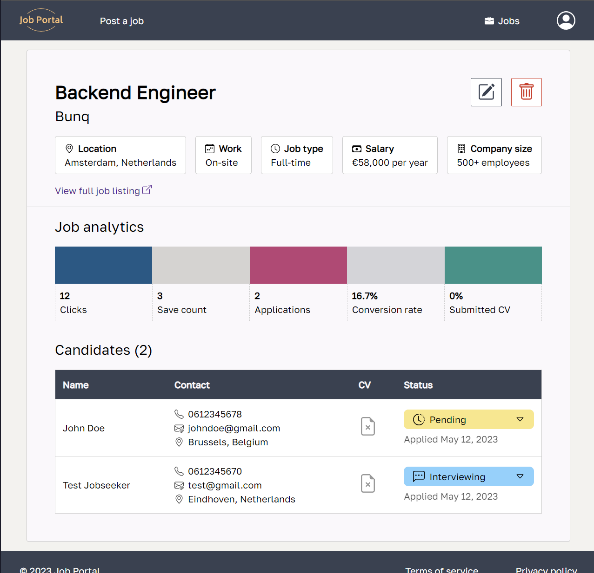
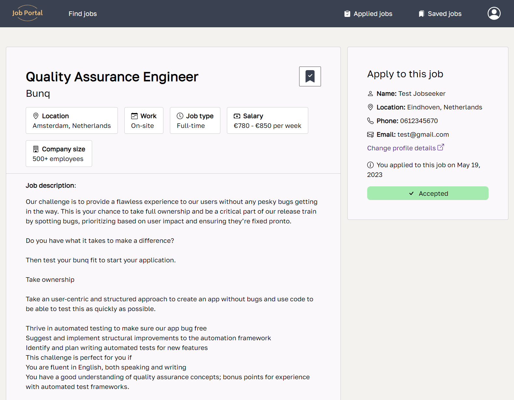
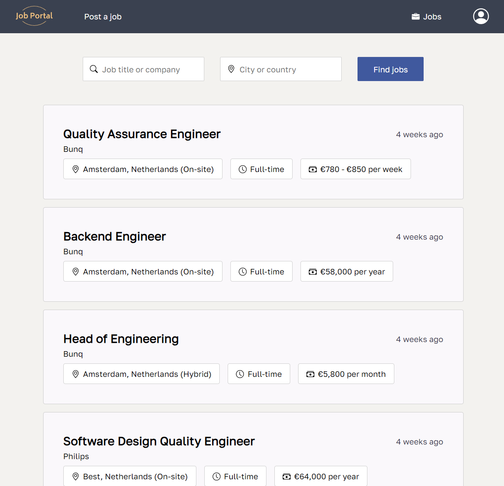
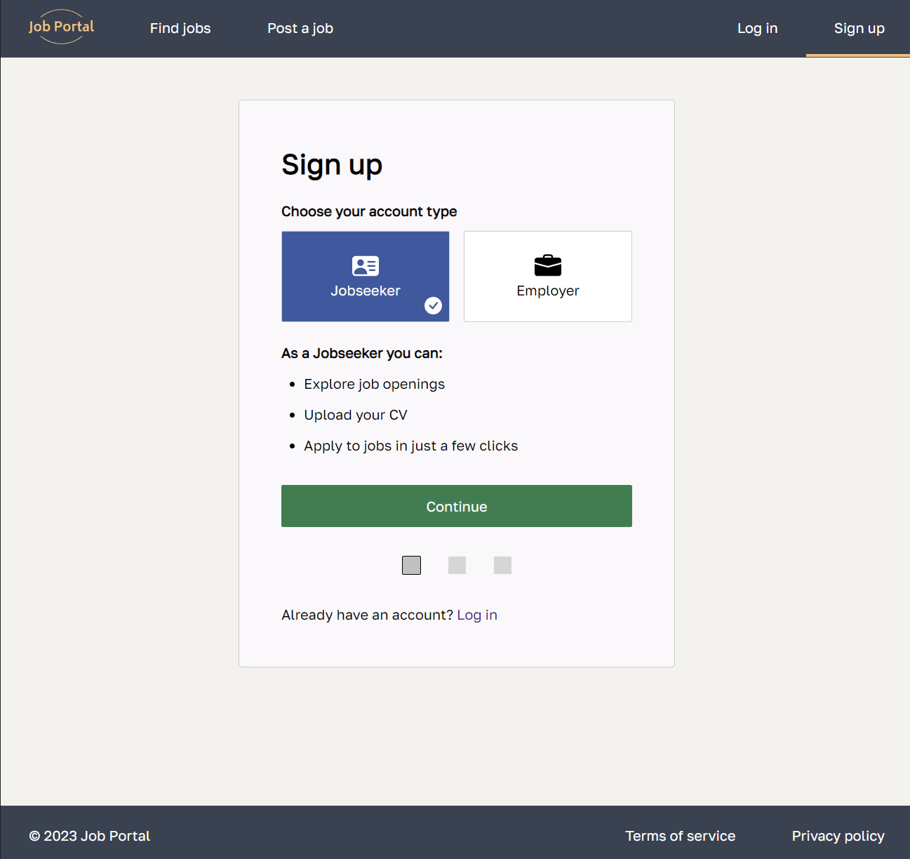

# Description

Job Portal is a platform for employers to post job listings and for job seekers to search for and apply to jobs.

The software system shares an MSSQL database and consists of:
- A desktop application built with Windows Forms .NET Core
- A web application built with ASP.NET Core Razor Pages

# Website

https://i505281.luna.fhict.nl/

# Screenshots

# Test accounts

Jobseeker:
- email: test@gmail.com
- password: test1234

Employer:
- email: bunq@gmail.com
- password: bunq1234